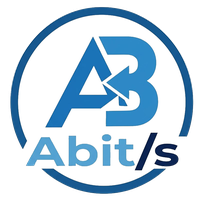

<p align="center">
  
</p>

<h1 align="center"> IGOR - ABit/s</h1>

<p align="center">Regia video di ABit/s</p>

Piccola regia video per Windows: una **finestra di regia** sul monitor principale e un'**uscita a tutto schermo** sul secondo monitor, dove si compongono segnali NDI, periferiche di acquisizione, un timer e una frase in sovraimpressione.

## Le due finestre

**Regia** (monitor principale)
- Pulsanti per aggiungere gli input: **segnale NDI**, **periferica di acquisizione**, **timer**, **frase**.
- Anteprima dell'uscita: si trascina un elemento per spostarlo e si usa l'angolo in basso a destra per ridimensionarlo (Maiusc mantiene le proporzioni); gli elementi si agganciano a bordi e centro.
- Elenco degli elementi dal primo piano allo sfondo, con *In onda / Nascosto*, *Solo questo* (mostra in uscita solo quell'input), *Avanti / Indietro* per l'ordine, *Elimina*.
- Per ogni elemento: posizione e misure in % dello schermo, *Schermo intero*, *Centra*, *Proporzioni 16:9*.
- Per NDI e acquisizione: ritaglio (crop) su ogni lato e adattamento *Adatta* (mantiene le proporzioni), *Riempi* (mantiene le proporzioni e taglia), *Deforma*.
- Scelta del monitor di uscita, colore di sfondo, mostra/nascondi uscita.

**Uscita** (secondo monitor)
- Si apre all'avvio, senza bordi, a tutto schermo sul monitor 2.
- Mostra un singolo input oppure la composizione di più input (per esempio segnale NDI + timer).
- Con un solo monitor collegato l'uscita appare come finestra di anteprima; collegando il secondo monitor si sposta da sola a tutto schermo.

## Elementi

**Timer**
- All'indietro (countdown, continua in negativo dopo lo zero) oppure in avanti (cronometro).
- Avvia / pausa / azzera, ±10 s e ±1 min anche in corsa; barra spaziatrice per avvio/pausa.
- Colore dei numeri, colore dello sfondo (o trasparente), misura e tipo di carattere, grassetto.
- Colore di avviso negli ultimi N secondi e colore a tempo scaduto.
- I numeri si rimpiccioliscono da soli se non entrano nel riquadro.

**Frase**
- Fascia nella parte bassa dello schermo (si può spostare).
- Se il testo è più lungo dello spazio disponibile scorre da destra a sinistra, altrimenti resta centrato.
- Velocità di scorrimento, colori, opacità della fascia, misura e tipo di carattere.

**Periferica di acquisizione**: schede di acquisizione, webcam, convertitori HDMI/SDI → USB (tutto ciò che Windows vede come videocamera).

**Segnale NDI**: elenco delle sorgenti NDI trovate in rete, qualità piena o bassa (meno banda).

La scena (elementi, posizioni, testi, colori) viene salvata e ritrovata al riavvio.

## Scarica

L'ultima versione per Windows (installer e portable) è sempre qui: **[Releases → ultima versione](https://github.com/battacharlie/MyGobbo/releases/latest)**.

## NDI

NDI usa il modulo nativo [`@stagetimerio/grandiose`](https://github.com/stagetimerio/grandiose) (NDI SDK 6). È una dipendenza *facoltativa*: durante `npm install` scarica l'NDI SDK e compila il modulo. Se non ci riesce, l'app funziona lo stesso e nel pannello NDI compare un avviso.

Per compilarlo su Windows servono gli strumenti di compilazione C++ ([Visual Studio Build Tools](https://visualstudio.microsoft.com/visual-cpp-build-tools/) con "Sviluppo di applicazioni desktop con C++") e Python. La GitHub Action li ha già, quindi l'`.exe` creato lì include NDI.

## Avvio in sviluppo

Serve [Node.js](https://nodejs.org/) 20 o successivo.

```bash
npm install
npm start
```

## Creare l'eseguibile per Windows

Su un PC Windows:

```bash
npm install
npm run dist
```

Nella cartella `dist/` trovi:

- `IGOR-ABits-Setup-x.y.z.exe` – installer;
- `IGOR-ABits-x.y.z-portable.exe` – versione portable, da avviare senza installare.

Nei nomi dei file e dei collegamenti l'app si chiama "IGOR - ABits" perché Windows non ammette il carattere `/`.

In alternativa, ogni push su `main` fa partire la GitHub Action **Build Windows**, che crea gli stessi `.exe`: li scarichi da *Actions → Build Windows → Artifacts* (serve un account con accesso al progetto).

Per pubblicare una nuova versione per tutti: aggiorna `version` in `package.json`, unisci in `main` e crea un tag con lo stesso numero (es. `v0.3.0`). La Action crea la Release con i due `.exe` allegati.

## Loghi

- `assets/ABits_Logo.png` – logo aziendale (README e finestre dell'installer).
- `assets/IGOR_Logo.png` – logo del software (icona dell'app e intestazione della regia).
- `build/` contiene icona e immagini dell'installer generate dai loghi.

## Struttura

```
src/
  main.js              processo principale: finestre, monitor, scena, comandi
  ndi.js               caricamento facoltativo di NDI e ricerca delle sorgenti
  shared/layers.js     tipi di elemento, calcolo del timer, crop
  shared/render.js     disegno della scena (uscita e anteprima in regia)
  control/             finestra di regia
  display/             finestra di uscita (riceve NDI e periferiche)
```

La scena vive nel processo principale e le due finestre ricevono lo stesso stato. Per consumare poco non c'è un ciclo che ridisegna a ogni fotogramma: i video sono elementi della pagina posizionati con CSS e composti dalla scheda video, il timer si aggiorna solo al cambio del secondo e la frase scorre con un'animazione CSS. L'anteprima in regia mostra riquadri con il nome degli input invece dei video, così i flussi non vengono decodificati due volte. Il timer è basato sull'orario di avvio, quindi resta preciso anche se una finestra rallenta. I fotogrammi NDI vengono ricevuti direttamente nella finestra di uscita, senza passare dal processo principale.
